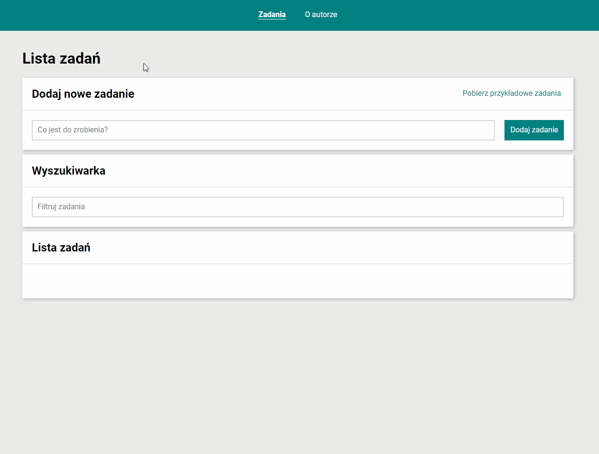
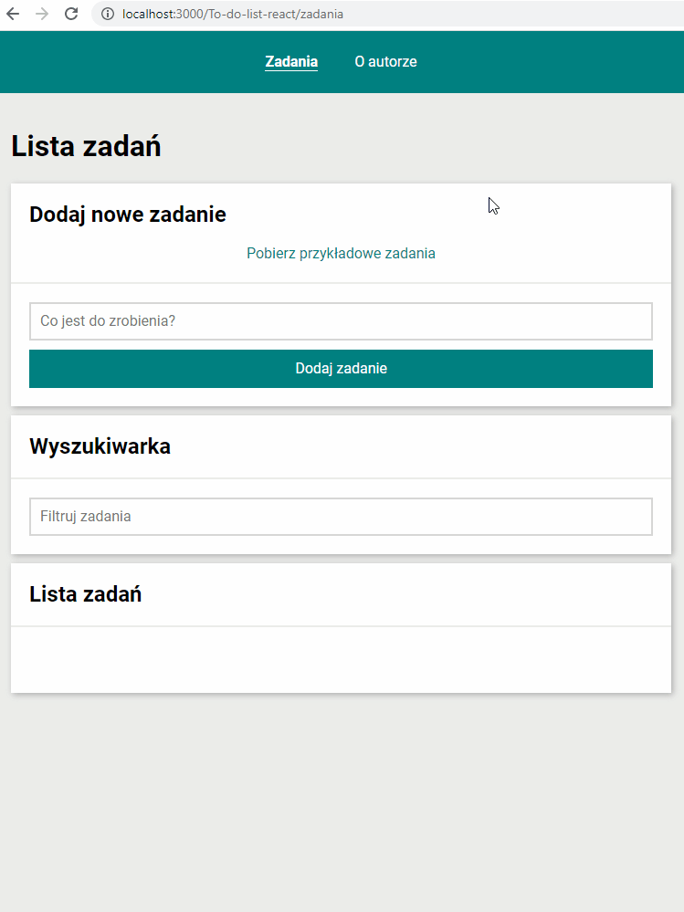

# Marcin Augun - To-do list in React

## Development in progress...

## Description

I present to you my To-do list created with React.js.

Using this tool is a great way to stay organized when we have a lot on our minds. Go ahead and make your day more bearable!

## Check out the [Demo](https://marcin10lw.github.io/Fullstack-Todo-list-react/)!

## YouCode

This project is a task within [YouCode](https://youcode.pl/zostawiam-maila/).

YouCode is a frontend development online school with great community.

## Technologies used

    ✔ REACT.JS
    ✔ CREATE-REACT-APP
    ✔ WEBPACK
    ✔ BABEL
    ✔ STYLED COMPONENTS
    ✔ FLEXBOX
    ✔ REDUX-TOOLKIT
    ✔ REDUX-SAGA
    ✔ REACT-ROUTER
    ✔ ES6+ FEATURES

## How I try to stand out (features added independently)

    ✔ The ability to change the title
    ✔ Task creation date
    ✔ Deadline functionality
    ✔ Notes field bootstrapped with tiny
    ✔ Tasks date filtering system

## How I plan to develope it

    🔲 Connecting with firebase
    🔲 Creating user authentication with firebase
    🔲 Creating firestore database
    🔲 Creating firestore storage

## Page Preview

## Page Not Found Preview

**Stay tuned for updates!**

## Create React App

This project was bootstrapped with [Create React App](https://github.com/facebook/create-react-app).

## Available Scripts

In the project directory, you can run:

### `npm start`

Runs the app in the development mode.\
Open [http://localhost:3000](http://localhost:3000) to view it in your browser.

The page will reload when you make changes.\
You may also see any lint errors in the console.

### `npm run build`

Builds the app for production to the `build` folder.\
It correctly bundles React in production mode and optimizes the build for the best performance.

The build is minified and the filenames include the hashes.\
Your app is ready to be deployed!

See the section about [deployment](https://facebook.github.io/create-react-app/docs/deployment) for more information.

### `npm run eject`

**Note: this is a one-way operation. Once you `eject`, you can't go back!**

If you aren't satisfied with the build tool and configuration choices, you can `eject` at any time. This command will remove the single build dependency from your project.

Instead, it will copy all the configuration files and the transitive dependencies (webpack, Babel, ESLint, etc) right into your project so you have full control over them. All of the commands except `eject` will still work, but they will point to the copied scripts so you can tweak them. At this point you're on your own.

You don't have to ever use `eject`. The curated feature set is suitable for small and middle deployments, and you shouldn't feel obligated to use this feature. However we understand that this tool wouldn't be useful if you couldn't customize it when you are ready for it.
